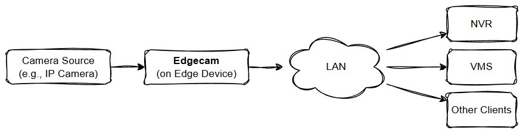

# Edgecam
작성 중 ...

## 1. 소개
엣지캠(Edgecam)은 카메라 소스로부터 영상 스트림을 수신하여 시각 인공지능 기반 영상처리 작업을 수행한 뒤 그 결과를 다시 송출하는 실시간 영상처리 미들웨어이다. 엣지 디바이스(Edge Device)에 특화된 경량 모델과 RTSP/ONVIF 프로토콜을 통해 카메라 소스에 의존적이지 않고 수평적 확장이 용이하다.

## 2. 주요기능
* **카메라 소스 설정** : ONVIF 프로토콜을 통해 IP 카메라를 자동으로 검색하거나, 직접 RTSP URL을 입력하여 스트림을 수신할 수 있다.
* **실시간 추론 및 처리** : 수신된 영상 스트림을 CUDA 가속을 활용하여 전처리, 추론, 후처리 과정을 신속하게 수행한다.
* **결과 스트림 송출** : 영상처리 결과가 반영된 영상 스트림을 NVR, VMS 등 여러 형태의 클라이언트에 실시간 송출한다.
* **메타데이터 지원** : 바운딩 박스나 클래스 정보 등 추론 메타데이터를 함께 전달해 커스터마이징을 효과적으로 지원한다.

## 3. 활용 시나리오
* 배회, 침입 등 물리적 보안이 필요한 환경에서 모니터링 담당자에게 실시간 알람을 제공한다.
* 도서관, 병원 등 개인정보보호를 위해 자동으로 영상을 비식별화(De-ID, De-Identification) 한다.
* 도난 방지, 쓰레기 불법 투기 경고 등 불법적 행위가 인식되면 담당자에게 알리거나 경고한다.

## 4. 설치 및 실행
작성 중 ...